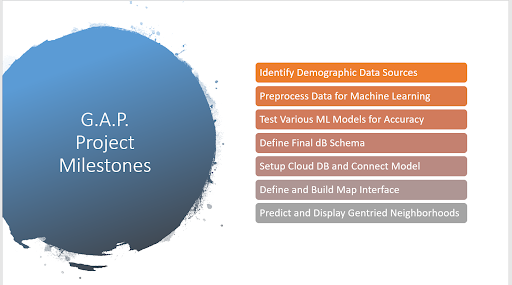
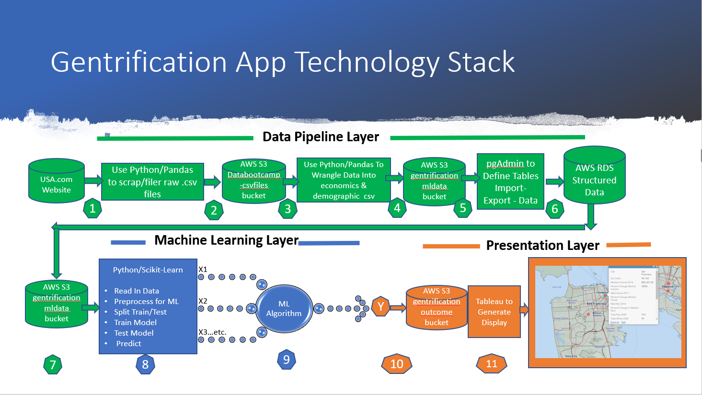

<!-- PROJECT LOGO -->
 

  

  <h3 align="center">Predicted Gentrification In California</h3>

  

    Predicting gentrification in the California state using machine learning.
     
    <a href="https://github.com/Team-Blue-MW/Predicted_Gentrification_in_California"><strong>Explore the docs »</strong></a>
     
     
    <a href="https://team-blue-mw.github.io/Predicted_Gentrification_in_California/" target="_blank">View Website</a>
    ·
    <a href="https://github.com/Team-Blue-MW/Predicted_Gentrification_in_California/issues">Report Bug</a>
    ·
    <a href="https://github.com/Team-Blue-MW/Predicted_Gentrification_in_California/issues">Request Feature</a>
  

<!-- TABLE OF CONTENTS -->
## Table of Contents

* [About the Project](#about-the-project)
  * [Built With](#built-with)
* [Analysis](#analysis)
  * [Machine Learning](#machine-learning)
  * [Tableau](#tableau)
* [Usage](#usage)
* [Roadmap](#roadmap)
  * [7 Major Milestones](#7-major-milestones)
  * [Technology Stack](#technology-stack)
* [Contact](#contact)

## About The Project
Gentrification is a growing concern among numerous neighborhoods in different cities, and a hot topic for developers looking to invest money. With this research we are hoping to find out the combination of factors in different areas that already have been gentrified to determine potential future candidates that 'have it all', using supervised machine learning classification algorithm. And, possibly define the 'opportunity zones' through clutering algorithms. (Opportunity zones being the investment in local buisnesses for a certain timeframe, in order to recive tax breaks) 

Where are the Opportunities Good For?
- Pandemic
- Market Crashing
- Whole Neighborhoods Need Major Investments
- Billionaires With Cash to Burn Just Waiting to Invest

### Built With

- [Python](https://www.python.org/)
- [AWS](https://aws.amazon.com/)
- [PostgreSQL](https://www.postgresql.org/)
- [Tableau](https://www.tableau.com/)
- [Bootstrap](https://getbootstrap.com)

## Analysis

### Machine Learning
Due to the complexity and multilayer nature of the topic we've selected, and not having complete data available, we had to create our dataset from scratch, hand picking only the features we were going to ultimately use in the mahcine learning model. The decision was based on societal and economic research conducted by other organizations. Hence, the feature selection part was done during the data collection. The downside is, we now have to manually create the outcome column based on existing data. This will require some time, as the plan is to find the already gentrified zipcodes, look at their metrics and come up with a formula/threshold for the rest of the dataset. And for the time being I created a mock outcome, just to see if it works.

As for the feature engineering, I am still debating between 2 algorithms, which are either Random Forest or Gradient Boost. Why I am debating between two: Random Forests require little parameter tuning, robust to noise (which I hope we've aleviated), they're interpretable and great for classification problems. However, using larger random forest require more memory and slows down the process, they do not predict beyond the range of the response values in the training data, and they can be very prone to overfitting.

Gradient Boost is less interpretable, but shows great perfomance, suitable for almost any ML problem, and I just personally like this algorithm. Cons: it requires parameter tuning and prone to overfitting.

Both of the algorithms don't require feature scaling. And at the moment we do not have any categorcial data, thus won't need to encode any variables.

UPD: I did a test run on the new dataset, Random Forest showed 100% on every metric, which is most likely the indicator of overfitting. Gradient Boost showed the same 'success'. Like I said before, they can be very prone to overfitting, and that is what I think happening here. That's why I did a test using Logistic Regression. The results are more modest, however, with the higher bias, the variance is lower in this case, which is a more preferable outcome.

Conclusion: The dataset needs more work done. For the ML model I might shift to simpler, much more interpretable algorithms, that are robust to overfit.

After having run several tests, using Logistic Regression and Random Forest, there was a realization that imbalanced datasets (our class ratio is 4:1)require a completely different evaluation and approach than balanced ones, because accuracy score is only reflecting the underlying class distribution in our case.

Hence, precision, recall and f1 score are the metrics I will pursue. And I chose Random Forest, because it has shown good performance on imbalanced data before due to its hierarchical structure (linear regression and simpler models aren't equiped to deal with class imbalance). It generally shows a better performance over the single tree classifier, yields generalization error rate and pretty robust to noise. However, RF tends to learn from the class imbalance, focusing on the majority class prediction accuracy rather than minority. To aleviate that, I am going to test balanced random forest and weighted random forest for our model to try to boost predictive performance on minority class.

To find the best parameters, I performed a grid search over specified parameter values using scikit-sklearn implemented GridSearchCV. After that I am going to calibrate the model by adjusting the cutoff by cross-validation. If the metris are still low, I might have to penalize the algorithm, i.e. assign higher missclassification cost.

Another option is to reframe the approach to anomaly detection instead of classification, but I'd like to refrain from that if possible.

### Tableau

## Usage

## Roadmap
### 7 Major Milestones

1. Identifying Data Sources
2. Scraping Data
3. Preprocess and ETL Data
4. Writing Machine Learning Code and Choosing the Model
5. Defining Database Schema and setting up S3 and RDS Databases
6. Dfine and Build Visual Presentation Layer
7. Predict and Display Gentrification Neighborhoods
8. Overall Architecture and Project Management

### Technology Stack

1. Python code used to scrap data and create 14 csv files for the different Features.
2. Stored on S3 server in “databootcamp-csvfiles” bucket. Read/Write permissions generated from AWS Server and embedded in “config” file.
3. Python/Pandas code used to wrangle data into 2 Dataframes - 1) “Economics, 2) Demographics. Outcome column added to Demographics. Outcome columns filled with “zeros”
4. Files stored on S3 Server in “Gentrificationmldata” bucket.
5. pgAdmin used to make connection to AWS relational database, define tables in RDS.
6. 2 files - Economic and Demographic - imported into their respective RDS tables and joined into a single table called “California_blank_tagged.” Exported to S3 server “gentrificationmldata” bucket.
7. Python used to pull ML input data from S3 server and preprocess for ML training.
8. 1100 Rows of data split into Training/Test sets and used to train ML Model. Model then “Predicts Gentrification zip codes in Test Dataset” placing a 1 in Outcome Column.
9. Using Python, Outcome “Y” then written into “Predicted Outcome” column in dataframe. Using Python the final “Predicted” file is stored on S3 server.
10. Tableau then imports the Predicted file and generates a Map showing the gentrified zip codes in color.

## Contact
